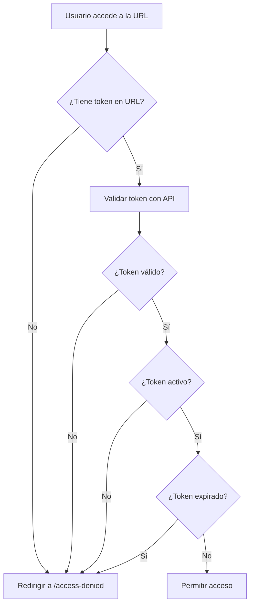

# Sistema de Gestión de Tokens

Este documento describe el sistema de autenticación basado en tokens para controlar el acceso a la presentación de GBM.

## 📋 Tabla de Contenidos

- [Descripción General](#descripción-general)
- [Instalación](#instalación)
- [Uso](#uso)
- [Comandos Disponibles](#comandos-disponibles)
- [Estructura de Archivos](#estructura-de-archivos)
- [Flujo de Autenticación](#flujo-de-autenticación)
- [Seguridad](#seguridad)

---

## Descripción General

El sistema de tokens permite:
- ✅ Generar URLs únicas para cada cliente
- ✅ Controlar el acceso a la presentación
- ✅ Establecer fechas de expiración
- ✅ Habilitar/deshabilitar acceso sin eliminar tokens
- ✅ Auditar accesos mediante registro de tokens

---

## Instalación

El sistema está preconfigurado. Solo asegúrate de que la carpeta `data/` existe:

```bash
mkdir -p data
```

---

## Uso

### 1. Generar Token para un Cliente

```bash
npm run token:generate "Nombre del Cliente" [días]
```

**Parámetros:**
- `Nombre del Cliente` (requerido): Identificador del cliente
- `días` (opcional): Días de validez (por defecto: 30)

**Ejemplo:**
```bash
npm run token:generate "Acme Corporation" 90
```

**Salida:**
```
✅ Token generado exitosamente!

📋 Información del Token:
   Cliente: Acme Corporation
   Válido por: 90 días
   Expira: 15/03/2025

🔗 URL para el cliente:
   https://presentacionrd.glaringmaintenance.do/?t=abc123def456...

📝 Token:
   abc123def456...

💡 Tip: Guarda esta URL y envíala al cliente de forma segura.
```

### 2. Listar Todos los Tokens

```bash
npm run token:list
```

**Salida:**
```
📋 Lista de Tokens:

================================================================================

✅ ACTIVO
Cliente:  Acme Corporation
Token:    abc123def456...
Creado:   15/12/2024
Expira:   15/03/2025
URL:      https://presentacionrd.glaringmaintenance.do/?t=abc123def456...
--------------------------------------------------------------------------------

🔴 DESHABILITADO
Cliente:  Old Client Inc
Token:    xyz789ghi012...
Creado:   01/11/2024
Expira:   01/02/2025
URL:      https://presentacionrd.glaringmaintenance.do/?t=xyz789ghi012...
--------------------------------------------------------------------------------

📊 Total: 2 token(s)
```

### 3. Deshabilitar Token

```bash
npm run token:disable <token>
```

**Ejemplo:**
```bash
npm run token:disable abc123def456...
```

**Salida:**
```
✅ Token deshabilitado exitosamente!
   Cliente: Acme Corporation
   Token: abc123def456...
```

### 4. Habilitar Token

```bash
npm run token:enable <token>
```

**Ejemplo:**
```bash
npm run token:enable abc123def456...
```

**Salida:**
```
✅ Token habilitado exitosamente!
   Cliente: Acme Corporation
   Token: abc123def456...
```

### 5. Eliminar Token

```bash
npm run token:delete <token>
```

**Ejemplo:**
```bash
npm run token:delete abc123def456...
```

**Salida:**
```
✅ Token eliminado exitosamente!
   Cliente: Acme Corporation
   Token: abc123def456...
```

---

## Comandos Disponibles

| Comando | Descripción | Uso |
|---------|-------------|-----|
| `token:generate` | Genera un nuevo token | `npm run token:generate "Cliente" [días]` |
| `token:list` | Lista todos los tokens | `npm run token:list` |
| `token:enable` | Habilita un token | `npm run token:enable <token>` |
| `token:disable` | Deshabilita un token | `npm run token:disable <token>` |
| `token:delete` | Elimina un token | `npm run token:delete <token>` |

---

## Estructura de Archivos

```
project/
├── data/
│   ├── tokens.json              # Archivo con tokens (NO incluir en git)
│   └── tokens.template.json     # Plantilla del archivo de tokens
├── scripts/
│   ├── generate-token.js        # Script para generar tokens
│   ├── list-tokens.js           # Script para listar tokens
│   ├── enable-token.js          # Script para habilitar tokens
│   ├── disable-token.js         # Script para deshabilitar tokens
│   └── delete-token.js          # Script para eliminar tokens
├── src/
│   ├── middleware.ts            # Middleware de autenticación
│   ├── app/
│   │   ├── api/
│   │   │   └── validate-token/
│   │   │       └── route.ts     # API para validar tokens
│   │   └── access-denied/
│   │       └── page.tsx         # Página de acceso denegado
└── .gitignore                   # Archivo que excluye tokens.json
```

---

## Flujo de Autenticación



### Descripción del Flujo

1. **Usuario accede**: El usuario intenta acceder a la presentación
2. **Middleware intercepta**: El middleware de Next.js intercepta la petición
3. **Verifica token**: Se busca el parámetro `t` o `token` en la URL
4. **Validación**: Se envía el token a la API `/api/validate-token`
5. **Verificaciones**:
   - ¿El token existe en la base de datos?
   - ¿El token está activo?
   - ¿El token no ha expirado?
6. **Resultado**:
   - ✅ Si todas las verificaciones pasan → Acceso permitido
   - ❌ Si alguna falla → Redirección a `/access-denied`

---

## Seguridad

### Buenas Prácticas

1. **NO subir tokens.json a git**
   - El archivo `data/tokens.json` está en `.gitignore`
   - Solo subir `data/tokens.template.json` como referencia

2. **Compartir URLs de forma segura**
   - Enviar por email cifrado o plataforma segura
   - No publicar URLs en sitios públicos

3. **Establecer fechas de expiración**
   - Usar períodos cortos para demos temporales
   - Renovar tokens para clientes permanentes

4. **Auditoría**
   - Revisar periódicamente tokens activos con `npm run token:list`
   - Deshabilitar tokens de clientes inactivos

5. **Respaldo**
   - Hacer backup regular de `data/tokens.json`
   - Guardar en lugar seguro fuera del repositorio

### Formato del Archivo tokens.json

```json
{
  "tokens": {
    "abc123def456...": {
      "clientName": "Acme Corporation",
      "createdAt": "2024-12-15T10:30:00.000Z",
      "expiresAt": "2025-03-15T10:30:00.000Z",
      "active": true
    }
  }
}
```

---

## Solución de Problemas

### Error: "No existe el archivo de tokens"

**Solución:**
```bash
# Crear el archivo manualmente
echo '{"tokens":{}}' > data/tokens.json
```

### Error: "Token no encontrado"

**Causa:** El token fue eliminado o nunca existió

**Solución:**
1. Verificar lista de tokens: `npm run token:list`
2. Generar nuevo token si es necesario

### No puedo acceder aunque tengo token válido

**Verificaciones:**
1. ¿El token está en la URL? (`?t=...`)
2. ¿El token está activo? (`npm run token:list`)
3. ¿El token no ha expirado?
4. ¿El archivo `data/tokens.json` existe?

---

## Mantenimiento

### Limpieza de Tokens Expirados

Ejecutar periódicamente:

```bash
# 1. Ver tokens expirados
npm run token:list

# 2. Eliminar tokens expirados manualmente
npm run token:delete <token-expirado>
```

### Renovación de Acceso

Si un cliente necesita acceso extendido:

```bash
# 1. Deshabilitar token viejo
npm run token:disable <token-viejo>

# 2. Generar nuevo token
npm run token:generate "Nombre Cliente" 90

# 3. Enviar nueva URL al cliente
```

---

## Soporte

Para problemas o preguntas:
- Email: support@gbmcorp.com
- Documentación: Este archivo

---

**Última actualización:** Diciembre 2024
**Versión:** 1.0